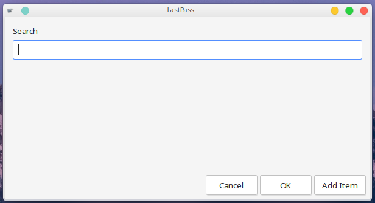
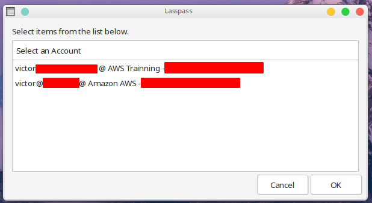
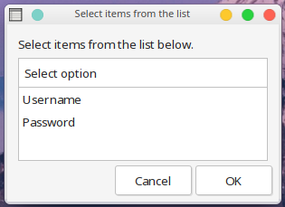
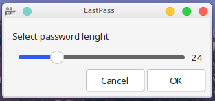
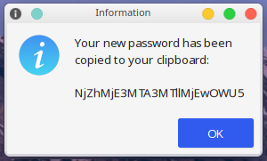
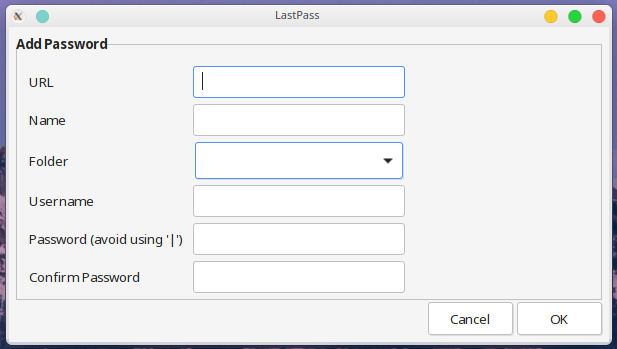

# lpass-zenity

This is a simple Bash script to provide a [Zenity](https://help.gnome.org/users/zenity/) GUI interface to [lastpass-cli](https://github.com/lastpass/lastpass-cli).

Username and passwords get copied to your clipboard with `xclip`. Initial login is handled by `lastpass-cli`.

### Requirements

+ [lastpass-cli](https://github.com/lastpass/lastpass-cli)
+ [xclip](https://linux.die.net/man/1/xclip)


## Instructions

#### Install

a. Clone this repo to your machine

```
git clone https://github.com/victorbrca/lpass-zenity.git
```

b. Copy the script to your path (like `~/bin`) and give it execute permission

```
cp lpass-zenity.sh ~/bin/.
chmod 700 ~/bin/lpass-zenity.sh
```

c. Edit the value of the variable `lpass_user` in the script to your LastPass username

```
#-------------------------------------------------------------------------------
# Sets variables
#-------------------------------------------------------------------------------
lpass_user="username@mydomain.com"
```

d. Run the command

```
lpass-zenity.sh
```

Optionally, you could add a keyboard shortcut to your DE to call the script.

### Usage

1. Execute the script
2. Give it a string to search (search is case insensitive)
3. Select the desired credential
4. Select the username and paste it (the Zenity window will automatically come back)
5. Select the password and paste it

- - -

# Screenshots

## Getting Credentials







## Adding Credentials







